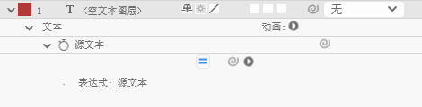

``` Javascript
timeFormat = "mm:ss:fff"; // 格式化为 分:秒:毫秒
timeToCurrentFormat(time)
```



<!--more-->

## 显示音频剩余时间

``` Javascript
duration = thisComp.duration; // 合成总时长
remaining = duration - time; // 剩余时间
timeFormat = "mm:ss:fff";
timeToCurrentFormat(remaining)
```

## 垂直显示

``` Javascript
// 时间显示 + 垂直排列
timeFormat = "mm:ss:fff";
timeStr = timeToCurrentFormat(time);

// 将每个字符用换行符连接，实现垂直排列
verticalStr = "";
for (i = 0; i < timeStr.length; i++) {
    verticalStr += timeStr[i] + "\n";
}

verticalStr
```

需注意：如果是纯数字，需添加双引号，双引号为英文状态下的双引号

## 时间截取

``` Javascript
timeFormat = "mm:ss:fff"; // 格式化为 分:秒:毫秒

timeToCurrentFormat(time).substring(3, 8)
```

未截取前的时间：小时（hh） ：分钟（mm） ：秒（ss） ：毫秒（fff）
- substring(3, 8)：表示从第三个下标位置开始截取，第8个下标位置处结束，截取 8-3 的数量

``` Javascript
str = "01:23:456";

// 提取前5个字符（分:秒）
result = str.substring(0, 5); // 返回 "01:23"

// 提取秒部分
result = str.substring(3, 5); // 返回 "23"

// 提取毫秒部分
result = str.substring(6);    // 返回 "456"
```

**其中，如果遇到 <code>verticalStr += timeStr[i] + "\n";</code> 这样的文本表达，需注意，<code>\n</code> 也会被算作字符**