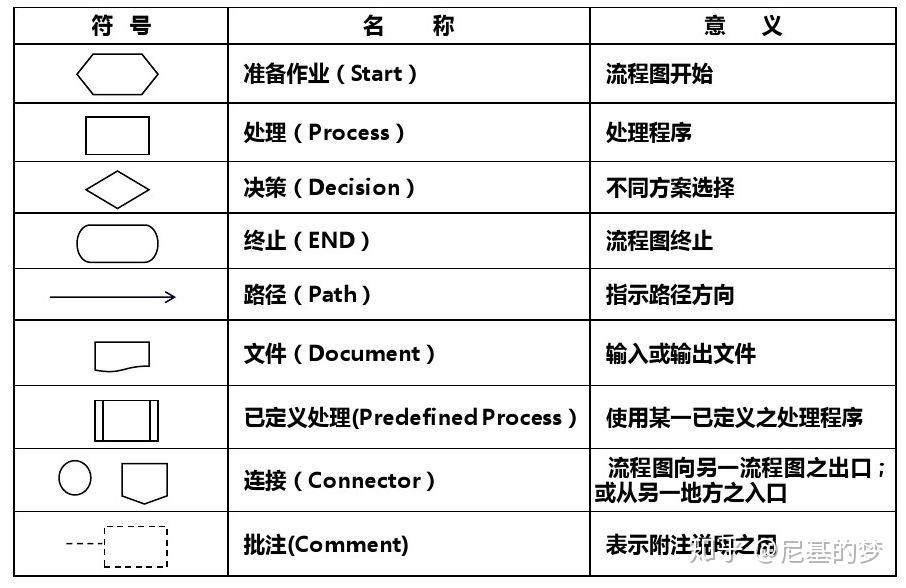

| Col1 | 16 | RGB | HSL | 颜色 |
| --- | --- | --- | --- | --- |
| 主题色 | #295B9B | 41, 91, 155 | 214, 74%, 38% |  |
| INFO | #039BE5 | 3, 155, 229 | 200, 99%, 45% |  |
| Warning | #FFB300 | 255, 179, 0 | 42, 100%, 50% |  |
| Error | #CC0033 | 204, 0, 51 | 345, 100%, 40% |  |
| Success | #4CAF50 | 76, 175, 80 | 122, 57%, 49% |  |

