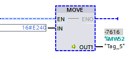

Q：Question？
A：Answer

##### Q：有的时候一直连接不上设备，明明网口连接正常，却总是搜索不到设备？
第一种尝试：设备断电
第二种尝试：保存软件内容后，关闭软件，重新打开软件
第三种尝试：重启电脑

<!-- more --> 

##### Q：面对没有用过的数据类型时，怎么办？
A：目前我所接触到的数据类型分两类，我将其分为文本格式和数组两大类

- 一类：文本格式：比如，二进制的书写方式，`2#0000_0000`，又比如时间，`T#2000MS`，这类直接书写出来的称为文本格式
- 二类：数组：同前端的数组一个意思，比如定时器需要用的块`IEC_TIMER`这种，或者DB快中的`Array[0..1] of Bool`创造的数组，等等

所以面对没有用过或者不怎么熟悉的数据类型时，第一步需要做的事情就是，这个数据类型的在程序中的表达方式是什么，是文本格式的还是数组的；第二步，在了解到表达方式后，再了解它如何使用的，最后，将其运用起来

##### Q：导通是啥意思？ ^LAD^ ^P163：底部^
A：应该是指线路得电或者说电路有电，就教导通，如常开按钮，按下时，常开变常闭，线路闭合，线路得电

##### Q：由于不满足前提条件，将不执行下载！？ ^G120^

检查项目的设备信息，核对设备型号，功率单元是否正确

##### Q：如何判断电机是什么类型的电机？ ^未回答^

> 有这么多电机，它们是如何辨别出来的？

##### Q：MOVE传值给的16进制，得到的为什么是负值？ ^MOVE^ ^负值^

1）数据类型错误，数据类型都有一个有效范围值，在这个范围内的值显示才会正常，若超出范围，可能会变成负数，此时需要根据的参数的范围调整编号变量的数据类型

##### Q：如何确认是高电平还是低电平？ ^高低电平^
A：高电平是啥，高电平是指正极（+）流出的电流，反之低电平，就是流向负极的电流
如果公共端接的是正极，那么它就是NPN（-+-），即低电平，反之，
如果公共端接的是负极，那么它就是PNP（+-+），即高电平。

##### Q：PLC 设备的 ERROR 警示灯一直在闪烁，如何处理？
A：新建一个设备，右击设备》【下载到设备】》硬件和软件（仅更改）即可解决

##### Q：编号变量显示的数值很奇怪，如：1_123_456？
A：
1. 检查编号变量的数据类型是否正确，如给的是100.0，但接收的编号变量是 Word，可能就会出现奇怪的数值
2. 调整程序的【显示格式】

##### Q：一个设备中的程序块在运行时，该设备的其他程序块会一起运行吗？
A：是的

## 程序结构

##### Q：如何重置FB块背景数据块中设置的参数？ ^程序结构：FB^
A：`MOVE`传值（有点不灵活）

##### Q：参数无法初始化？

参数是否在 `Output` 中，因为`Output`只能被赋值不能被读取，比如 `#step := #step + 1;` 这样的，所以你需要用到一个静态变量来处理参数，然后再赋值给`Output`中的变量

## 模拟量

##### Q：模拟量中常用到的数字量 0~27648 是怎么来的？ ^模拟量^
在模拟量中，常用到的数字量`0-27648`**是由西门子公司设定的**。

西门子公司的模拟量对应的数字量程是`-32768`到`+32767`。

由于西门子公司考虑到信号异常时的情况，预留了一定的余量，因此采用了`-27648`到`+27648`的数字范围。

其中，数字量`27648`与`32767`相比，有大约`15%`的裕量，比`32000`更“保险”一些。

##### Q：为什么FB块中明明是INOUT，为什么赋值后，却没有达到预期效果？

如上图所示，当【自动】接通时，会判断谁的信号灯没亮，若它的运行时长是最小的，那么就点亮它，但是当我运行时，发现线圈是通了，但是我的【模块】引脚处仍然是False，参数没有修改到，很奇怪，为什么明明已经是INOUT了，还无法修改参数，上面没有变化，下面确是通的？

原因就在于PLC的扫描周期，是从上至下的，所以，我们需要调整一下程序段的顺序

这样就能达到预期的效果

## 运动控制

##### Q：使能是啥？ ^运动控制^ ^尚未回答^

##### Q：如何辨别硬件上下限限位开关是高电平还是低电平？ ^运动控制^
A：硬件上的限位，若是用传感器来表现的，那么则看传感器是什么类型的设备，PNP还是NPN
- 若是PNP（+-+），则是高电平
- 若是NPN（-+-），则是低电平

##### Q：硬限位是啥？ ^运动控制^
A：限位何意？即，限制移动，移动到最大值时，停止前行，即为限位。

“硬限位”：硬件上的移动限制，比如用【传感器】表示，假设该传感器被激活，则表示已达到硬件的移动的距离上限

##### Q：到达限位上限时，点动、回原位这些操作都不能让轴移动分毫，怎么办？ ^运动控制^
A：假如你在轴的【调试】状态下，一般右下角会提示你如类似于这样的文本：“达到限位上限”，此时你需要做一件事，需要点击【确认】表示你已知晓它达到限位，

它设计这个点的原因，从我的理解来看，是为了增加一定的安全措施，避免已达到上限，你还在不停的让其处于上限的操作，心里还在想：“为什么不动了呢？”

可能是出于这一点的考虑，需要你手动点击确认，表示你已知晓

之后，将轴往反方向运行，让轴脱离限位感应器的感应

得出，需要用到：
- Reset：复位》触发一次表示你已知晓
- MoveJog：点动，单方面执行前进和后退》脱离限位感应
- 对应的定位方式》脱离限位感应

## 通信

##### Q：数据位 8 位是啥意思？ ^通信^

是指 Byte，Byte 是 8 位的

##### Q：台达手册中提到 `Modbus RTU模式，数据格式<8,N,2>` 啥意思？ ^MODBUS_RTU^

- 8：表示 数据位 8 位
- 2：表示 停止位 2 位
- N：表示 奇校验
- E：表示 偶校验
- O：表示 无校验

##### Q：台达手册中提到的`Bit0~1`是什么意思？
A：如下图，频繁提到的`Bit0~1`是指地址的下标为，如16位地址，由4组0000构成
- `Bit0~1`：就表示下标0和下标1
- `Bit2~8`：表示下标2~下标8之间地址
  

---

## 其他
Q：如何在简历中描述自己会模拟量？
- 具备模拟量相关知识，**能熟练进行模拟量的操作和应用**。
- 掌握模拟量的原理和技术，能够有效处理各类模拟量问题。
- 对模拟量有深入的理解，能准确进行模拟量的采集、分析和处理。
- 拥有模拟量的实践经验，熟练运用相关技术解决实际问题。
- 具备处理模拟量的能力，能确保模拟量系统的稳定运行。
- 熟悉模拟量的工作流程，能高效完成模拟量相关任务。
- 精通模拟量的运用，能根据需求进行合理的配置和调整。
- 掌握模拟量的关键技术，能有效提高模拟量系统的性能。
- 对模拟量的应用有深刻的认识，能将其灵活应用于各种场景。
- 具备模拟量的专业技能，能为项目提供可靠的模拟量解决方案。

Q：如何在简历中描述自己会MODBUS、PUT/GET 通信？

- 熟练掌握 MODBUS、PUT/GET 通信协议，具备相关项目实践经验。
- 拥有 MODBUS、PUT/GET 通信的专业知识，能进行高效的通信配置与调试。
- 对 MODBUS、PUT/GET 通信有深入理解，能熟练应用于各种系统集成项目。
- 具备运用 MODBUS、PUT/GET 通信进行数据传输和设备控制的能力。
- 熟悉 MODBUS、PUT/GET 通信的原理和规范，能确保通信的稳定性和可靠性。
- 掌握 MODBUS、PUT/GET 通信的编程方法，能独立开发通信模块。
- 在项目中成功应用 MODBUS、PUT/GET 通信，**实现设备之间的数据交互**。
- 具有 MODBUS、PUT/GET 通信的故障排查与解决能力。
- 了解 MODBUS、PUT/GET 通信的优势与局限性，能根据实际需求进行合理选择。
- 具备根据不同设备和场景进行 MODBUS、PUT/GET 通信配置的能力

Q：如何在简历中自己会SCL？
- 熟练掌握 SCL 语言编程，具备丰富的编程经验。
- 拥有 SCL 语言编程技能，**能够独立完成相关编程任务**。
- 对 SCL 语言编程有深入了解，可运用其进行复杂程序设计。
- 具备运用 SCL 语言编程解决实际问题的能力。
- 在项目中熟练应用 SCL 语言编程，保证项目的顺利进行。
- 掌握 SCL 语言编程的核心概念和技术，能高效编写代码。
- 熟悉 SCL 语言编程的语法和规则，编写的代码质量高。
- 具有良好的 SCL 语言编程能力，可优化程序性能。
- 熟练运用 SCL 语言编程，实现各种功能需求。
- 具备 SCL 语言编程的实践经验，能够快速适应不同项目的编程要求。

Q：自动化系统的整体架构是怎样的？
1. **传感器和执行器**：用于检测和控制物理参数，如温度、压力、流量等。
2. **控制器或 PLC**：负责处理输入信号，执行控制逻辑，并向执行器发送控制指令。
3. **人机界面**：提供操作员与系统交互的接口，包括显示屏、触摸屏等。
4. **通信网络**：连接各个组件，实现数据传输和交换。
5. **数据库**：存储系统的数据和配置信息。
6. **编程和组态软件**：用于编写控制逻辑和配置系统参数。
7. **监控和诊断系统**：实时监测系统状态，提供故障诊断和报警功能。
8. **电源和配电系统**：为整个系统提供电力支持。
   其特点包括：
1. **分布式控制**：各个组件分布在不同的位置，通过通信网络进行连接和协作。
2. **可靠性高**：采用冗余设计和故障诊断功能，确保系统的稳定运行。
3. **可扩展性强**：便于添加新的组件和功能。
4. **开放性好**：支持与其他系统的集成和交互。
5. **易于维护和管理**：提供方便的监控和诊断工具。
