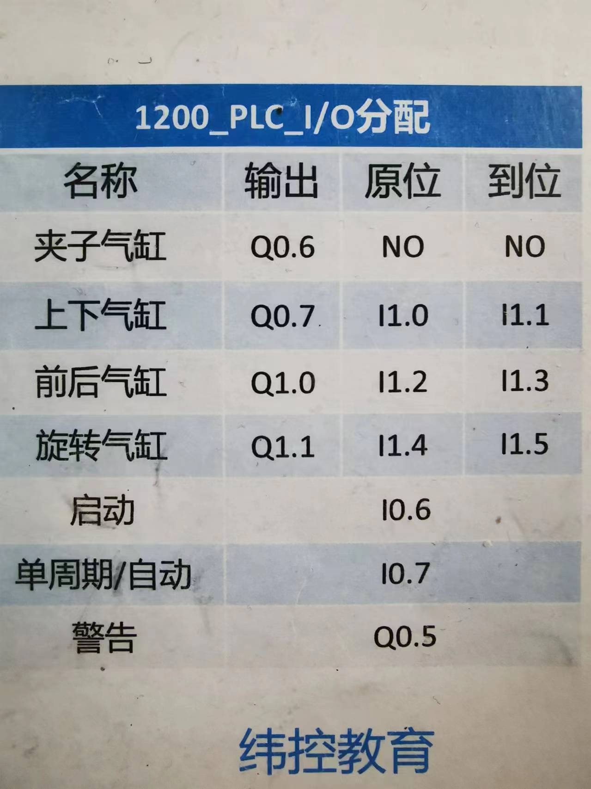

## 上位机

上位机是指用于监控和控制下位设备的具有强大计算能力和数据处理能力的计算机系统。
上位机在多个领域有广泛应用：
1. 工业控制：监控生产过程。
2. 自动化系统：协调各设备的运行。
3. 实验室设备：控制实验仪器。
4. 智能家居：实现家居设备的集中管理。

上位机作为控制和管理下位设备的核心部分，提高了系统的智能化和自动化水平。

其主要特点和功能包括：
1. 数据采集与监测：实时获取下位设备的数据信息。
2. 控制与操作：发送指令来控制下位设备的运行。
3. 数据处理与分析：对采集的数据进行处理和分析。
4. 人机交互：提供友好的用户界面，方便操作和监控。
5. 通信功能：与下位设备进行数据通信。
6. 系统管理：包括用户管理、权限设置等。
7. 数据存储：存储相关数据，便于查询和追溯。

> 上位机所做的事情同前端工作及其相似，通过可视化界面去控制和监控程序的运行，负责数据的增删改查和人机交互工作
>
> 假设现在的我写的没有让现在的你理解到
>
> 比如触摸屏就算作是上位机中一种，且是最常见的上位机，
> 日常生活中时常容易听到的或看到的：智能家居系统、自动化停车场系统
> 典型设备类型：电脑，手机，平板，面板，触摸屏

<!-- more --> 

## 下位机

下位机指直接与机器相连接的计算机或单片机，一般用于接收和反馈上位机的指令，并且根据指令控制机器执行动作以及从机器传感器读取数据。
典型设备类型：PLC，STM32，51，FPGA，ARM等各类可编程芯片

上位机软件：
用于完成上位机操作交互的软件被定义为“上位机软件”；比如TIA（博途）

## 串口
## 非标设备
## 非标准自动化

## HMI
HMI 指触摸屏

## 点位表
点位表指现场需要采集的点数，分开关量输入、输出，模拟量输入、输出。以此来配置PLC需要多少I/O模块

点位表是记录PLC（可编程逻辑控制器）所使用的输入输出点位以及对应的地址、类型、命名等信息的重要文档。

通过查看点位表，相关工作人员可以清楚地了解PLC与外部设备之间的连接关系，并在程序编写过程中准确地引用这些点位。

## UDT：自定义数据结构
用前端的方式理解的话，它和Object及其相识，或者可以将其理解为小号的DB块

一般而言，DB块中只能创建固定类型的变量或者数组变量，数据类型都是固定的，不是很灵活

## PTO
PTO 是 Pulse Train Output 的缩写，意为脉冲串输出。

在西门子PLC S7-200系列中，PTO指令用于S7-200 CPU集成点Q0.0和Q0.1的脉冲输出，其CPU需要使用晶体管输出类型。PTO可以产生单段脉冲或通过使用脉冲包络产生多段脉冲，具有手动运行和包络运动等功能。

## 电流

> **电流通常是指沿导体传输的电荷流动**。
它可以是恒定的直流电流（电荷持续流动），也可以是交流电流（电荷周期性地来回流动）。
而脉冲通常指的是突然而短暂的电流或电压变化，它们可能是由于开关操作、传感器触发或其他瞬时事件引起的。
因此，虽然**电流可以在脉冲中存在，但电流并不专指脉冲，而是指电荷的流动**。

可以简单的理解为：电流是脉冲，但脉冲不一定是电流

## 电压

电流好比水管中的水流流速，当打开阀门时，水会顺着管道流出，流速越快电流越大

比如水库倾斜而下的水流，看做是电流的话，此时的电流是极大的

电压好比水锤，当水流的流速过大关闭阀门时产生的阻力就越大，水流流速和关门时对对流造成的阻力即是水锤效应，

所以，电流流速越大，根据阻力的大小，决定电压的大小，

    公式：电压（V） = 电流（I） * 电阻（R）

若电阻不变，那么电流和电压是成正比的，比例系数就是电阻