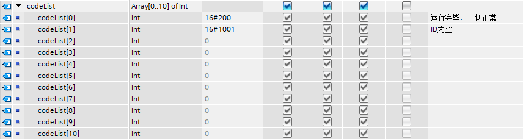

每次都向FB块中传入全局DB或者全局PLC编号变量，随着嵌入深度的增加，想要向外传递更改变量参数，会变得十分困难

因此，构筑一个模块专门用来完成参数的修改，于是我想到了前后端接口的调用，所以尝试弄了一个简易版的传参，类似于前端的inject

## 创建对应API文件

1. **程序块 > 右击程序块 > “新增块”**
   会创建一个文件夹，将其命名为API，之后这个文件夹只负责创建用于修改全局变量的FB块或者FC块

2. **PLC 数据类型 > 右击PLC 数据类型 > “新增块”**：会创建一个文件夹，将其命名为 API，之后这个文件夹只负责创建用于修改全局变量的UDT

<!-- more --> 

## UDT

使用UDT构筑自定义数据类型

| API_Result 参数 | 数据类型 | 默认值 | 描述 |
| --- | --- | --- | --- |
| ID | String[48] | '' | 调用标识，除了用于辨别，无他用 |
| code | Int | 0 | 状态码 |
| codeIndex | Int | 0 | codeList 的下标 |
| codeList | Array[0...?] of Int | -- | 状态码列表，安全信息，警告信息，错误信息都放在里面 |
| data | 自定义类型 | -- | 用于返回API执行后的结果，自己想放什么放什么，没规定 |



Q：这个有什么用？
偷懒和方便维护，因为结构固定，且一般情况下若是要用到这个，表明你可能受到嵌套传参困难的问题

## API?

- 程序块 > API > setHLD：修改红绿灯参数

  根据上面UDT复制一份，路径：PLC 数据类型 > API > API_Result_1，改名为 ResultHLD，更具情况再调整
    - Input
        - Run: Bool API 开关
        - ID：String[48] 标识
        - params 自定义的UDT，这个是关键点，Output.result用不用自定义都可以，但是这个一定要用
    - Output
        - result: ResultHLD(自定义的)

``` Javascript
IF NOT #Run THEN
    RETURN;
END_IF;

#result.code := #result.codeList[#result.codeIndex];

IF #ID = '' THEN
    #result.codeIndex := 1;
    RETURN;
END_IF;

// 接收参数，然后去修改全局参数
"HLD" := #HLD;

#result.code := 200;
#result.data := "HLD";
```