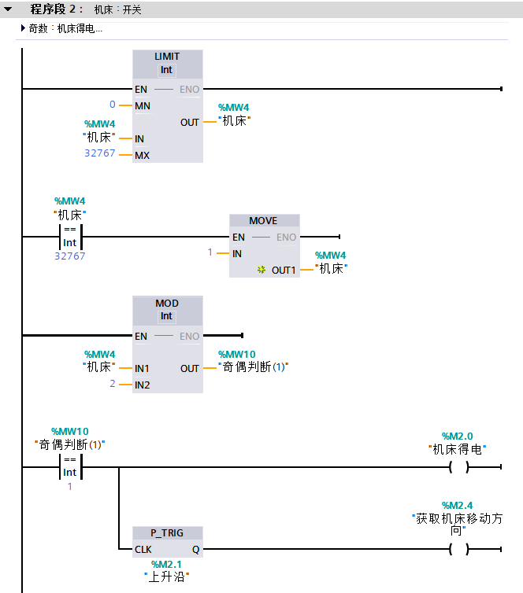

## 1. 起保停

**`I0.0` 接通 `I0.1` 断开 `Q0.0` 输出，`I0.1` 接通时，`Q0.0` 关断输出，即 `I0.0` 为启动按钮 `I0.1` 为停止按钮 `Q0.0` 为输出；**


<!-- more --> 

## 2. 正反转控制

**有一正转启动按钮 `I0.0`，一反转启动按钮 `I0.1`，一停止按钮 `I0.2`，正转输出 `Q0.0`，反转输出 `Q0.1`，要互锁；**


## 3. 单按钮控制

**：利用一个按钮控制电机的启动与停止，`I0.0`第一次接通时 `Q0.0` 输出，电机运转，`I0.0` 第二次接通时 `Q0.0` 关断输出，电机停止；**


- `RS`
  

- 计数器 + 比较
  

## 4. 混合控制

**：一台电机即可点动控制，也可以长动控制，`I0.0` 为点动按钮 `I0.1` 为长动的启动按钮 `I0.2` 为长动的停止按钮 `Q0.0` 为输出点控制电机运转，两种控制方式之间要有互锁；**

- `I0.0` 为点动按钮
- `I0.1` 为长动的启动按钮
- `I0.2` 为长动的停止按钮
- `Q0.0` 为输出点


## 5.连锁控制

**：某设备由两人操作，甲按了启动按钮 `I0.0`，乙按了启动按钮 `I0.1` 后 `Q0.0` 输出设备才可以启动，两按钮不要求同时按，按钮了停止按钮 `I0.2` 后设备停止**


或使用【MOVE + 比较】、【计数 + 比较】的方式实现，但总的思路基本没有改变，和上图基本一致

## 6.顺序控制

**：每按一次启动按钮启动一台电机，每按一次停止按钮，停掉最后启动的那台电机，按下紧急停止按钮，停止所有的电机，`I0.0` 为启动按钮 `I0.1` 为停止按钮 `I0.2` 为紧急停止按钮 `Q0.0`~`Q0.3` 为电机控制的输出点**

- 单按钮启动
- 单按钮关闭
- 单按钮一键关闭


## 7. 正反转

**：按下启动按钮 I0.0 电机正转，机床正向移动，当撞到正向限位开关 I0.2 时，电机停止，接着反转启动，机床反向移动，当机床撞到反向限位开关 I0.3 时，电机停止，又正转运行，如此循环，当按下停止按钮 I0.1 后机床不会马上停止，而是反转到位后才停止，Q0.0 为正转输出 Q0.1 为反转输出；**

> - 按下启动按钮 I0.0 电机正转，机床正向移动
> - 撞到正向限位开关 I0.2 时，电机停止，接着反转启动，机床反向移动
> - 撞到反向限位开关 I0.3 时，电机停止，又正转运行
> - 按下停止按钮 I0.1 后机床不会马上停止，而是反转到位后才停止，Q0.0 为正转输出 Q0.1 为反转输出；

- 有一个启动按钮，
- 有首尾两个感应器，首：`I0.2`；尾：`I0.3`
    - 当头部感应器触发时，机器停止运作，
    - “接着反转启动，机床反向移动”：比如说，一秒之后，再掉头前往尾部感应器
    - 尾部感应器，如上，同理
- 有一个关机按钮，按下后，不会立即停止运行，反转到位后才停止
  也就是说必须等到完整的一轮流程，即触发尾部感应器操作完成后，才能停止点击运转
- 头部感应器，有一个信号灯：Q0.0
- 尾部感应器，有一个信号灯：Q0.1





## 8. 两灯交替闪烁

**：当按下启动按钮 I0.0，Q0.0 亮一秒后灭，Q0.1 亮 2 秒，如此循环，当按下停止按钮 I0.1，输出停止；**

```
# 按下按钮后，逐个点亮

# 当前灯亮时，熄灭上一盏灯

# 每亮一盏灯，这盏灯的持续时间比上一盏灯多 1 秒钟

# 按下停止按钮，输出停止？
    输出停止，如果是字面意思的话，就是停止自动亮灯的操作，如果是这个意思，那么这个停止按钮是一个暂停，
    也就是说，再次按下启动按钮后会继续输出
```


因为停止按钮（如果没理解错误的话，是暂停效果）的原因，要恢复输出，那么启动按钮就不能做初始化操作


## 9. 小功率电机的星三角控制<span style="color: #CC0033">^习题未做^<span>

**：一个启动按钮 `I0.0`，一个停止按钮 `I0.1`，一个主输出 `Q0.0`，星形输出 `Q0.1`，三角输出 `Q0.2`，用一个定时器，要互锁；**

```
# 一个启动按钮：I0.0
# 一个停止按钮：I0.1
# 一个主输出：Q0.0
# 一个星形输出：Q0.1
# 一个三角形输出：Q0.2
# 一个定时器
# 要互锁
```

## 10. 大功率电机的星三角控制<span style="color: #CC0033">^习题未做^<span>

**：一个启动按钮 `I0.0`，一个停止按钮 `I0.1`，一个主输出 `Q0.0`，星形输出 `Q0.1`，三角输出 `Q0.2`，用两个定时器，一个启动延时用，一个是星形转三角时延时 0.2 秒用，要加互锁；**

## 11.延时启动、延时停止

**：按下启动按钮 `I0.0` 延时3秒电机启动，按下停止按钮 `I0.1` 延时 5 秒电机停止，电机控制输出点为 `Q0.0`；**

```
# 按下启动按钮后，延时 3 秒 启动电机
# 按下停止按钮后，延时 5 秒 停止电机
```


- TON 定时器，左侧**有电**才会开始计时，计时完成后，右侧通电，故得名：通电延时定时器
- TOF 定时器，左侧**没电**也能计时，并在计时期间，右侧始终保持通电状态

## 12. 延时自动关断

**：按下启动按钮 `I0.0`，`Q0.0` 输出，30 秒后 `Q0.0` 输出停止，任意时刻按下停止按钮 `I0.1`，`Q0.0` 立即停止输出；**


## 13. 五台电机顺序启动逆序停止

**：按下启动按钮 I0.0，第一台电机启动 Q0.0 输出，每过 5秒启动一台电机，直至五台电机全部启动，当按下停止按钮 I0.1，停掉最后启动的那台电机，每过 5 秒停止一台，直至五台电机全部停止，任意时刻按下停止按钮都可以停掉最后启动的那台电机；**

- 按下I0.0点亮Q0.0，
- Q0.0 点亮后每隔 5 秒点亮一个，直到点亮 5个
- 按下 I0.1 停止最近点亮的灯，之后每隔 5 秒灭一个
- 任意时刻按下 I0.1 都可以停止一盏灯

I0.1 操作的优先级最高
